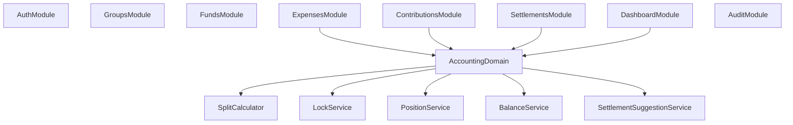

# Mimic Backend Accounting Module Map v0.2

Date: 2026-04-07
Scope: NestJS module, service, and utility mapping for Mimic accounting logic

## Goal

Map the accounting implementation note into concrete NestJS responsibilities so the backend can be built with clear boundaries and minimal duplication.

## Design Principles

* keep HTTP concerns in controllers
* keep orchestration in application services
* keep deterministic accounting logic in pure domain utilities
* centralize settled-period lock checks
* centralize read-model rebuild logic
* never scatter split or rounding logic across multiple modules

## Recommended Module Boundaries



## Module Responsibilities

### `ContributionsModule`

Owns:

* contribution CRUD endpoints
* contribution DTO validation
* contribution write transaction orchestration

Depends on:

* `SettledPeriodLockService`
* `ContributionValidationService`
* `AuditLogService`

Should not own:

* split allocation
* settlement suggestion logic

### `ExpensesModule`

Owns:

* expense CRUD endpoints
* payer and split persistence transaction
* expense-specific validation orchestration
* correction expense creation flow

Depends on:

* `SettledPeriodLockService`
* `ExpenseValidationService`
* `SplitCalculator`
* `AuditLogService`

Should not own:

* member position aggregation queries
* settlement completion

### `SettlementsModule`

Owns:

* settlement suggestion endpoint
* settlement create / complete / cancel flows
* period lock creation by completed settlement

Depends on:

* `PositionReadService`
* `SettlementSuggestionService`
* `SettledPeriodLockService`
* `AuditLogService`

Should not own:

* expense split logic

### `DashboardModule`

Owns:

* fund summary read endpoint
* dashboard aggregation endpoint

Depends on:

* `FundBalanceReadService`
* `PositionReadService`
* `RecentActivityReadService`

Should not own:

* write logic

## Accounting Domain Layer

Recommended path:

```text
backend/src/modules/accounting/
  accounting.module.ts
  services/
  utilities/
  types/
```

## Recommended Service / Utility Split

### Pure Utilities

These should be deterministic and side-effect free.

#### `SplitCalculator`

File:

* `backend/src/modules/accounting/utilities/split-calculator.ts`

Owns:

* `allocateEqualShares()`
* `allocateRatioShares()`
* `allocateFixedShares()`
* `allocateHybridShares()`
* `allocateExpenseSplits()`

Input:

* DTO-like normalized expense allocation input

Output:

* array of allocated split results

#### `MoneyAllocationPolicy`

File:

* `backend/src/modules/accounting/utilities/money-allocation-policy.ts`

Owns:

* integer rounding strategy
* deterministic remainder distribution by `sort_order`

### Domain Services

These may coordinate DB reads, validation, and utilities.

#### `SettledPeriodLockService`

File:

* `backend/src/modules/accounting/services/settled-period-lock.service.ts`

Owns:

* `isDateLocked(fundId, occurredOn)`
* `assertRecordWritable(fundId, occurredOn)`
* helper queries for completed settlements covering a date

Used by:

* contributions
* expenses
* settlements
* future restore/delete flows

#### `ContributionValidationService`

File:

* `backend/src/modules/accounting/services/contribution-validation.service.ts`

Owns:

* validate contribution type
* validate amount rules
* validate active membership
* validate writable date

#### `ExpenseValidationService`

File:

* `backend/src/modules/accounting/services/expense-validation.service.ts`

Owns:

* validate payer total
* validate split total
* validate split mode input completeness
* validate member participation
* validate writable date

Depends on:

* `SplitCalculator`
* `SettledPeriodLockService`

#### `FundBalanceReadService`

File:

* `backend/src/modules/accounting/services/fund-balance-read.service.ts`

Owns:

* `rebuildFundBalance(fundId)`
* optional cached read-model refresh hook later

#### `PositionReadService`

File:

* `backend/src/modules/accounting/services/position-read.service.ts`

Owns:

* `rebuildMemberPositions(fundId)`
* per-member net position map

#### `SettlementSuggestionService`

File:

* `backend/src/modules/accounting/services/settlement-suggestion.service.ts`

Owns:

* `buildSettlementSuggestion(positions)`
* transfer normalization
* zero-value filtering

Depends on:

* `PositionReadService`

#### `CorrectionPostingService`

File:

* `backend/src/modules/accounting/services/correction-posting.service.ts`

Owns:

* correction-specific guardrails
* posting logic for correction contribution / expense
* title requirement and writable-date check

## Application Service Mapping

### `ContributionsService`

Should orchestrate:

1. load fund and membership context
2. call `ContributionValidationService`
3. persist contribution in transaction
4. write audit log

### `ExpensesService`

Should orchestrate:

1. load fund and membership context
2. call `ExpenseValidationService`
3. call `SplitCalculator`
4. persist expense + payers + splits in one transaction
5. write audit log

### `SettlementsService`

Should orchestrate:

1. call `PositionReadService`
2. call `SettlementSuggestionService`
3. create settlement record
4. complete settlement and mark status
5. rely on `SettledPeriodLockService` for future write denial

## Query / Persistence Guidance

### Keep Writes Transactional

Must be persisted in a single DB transaction:

* expense
* expense payers
* expense splits
* settlement completion + audit log

### Keep Read Models Derived

For MVP:

* calculate balance and positions from source records
* do not maintain an authoritative mutable balance column

## Suggested File Layout

```text
backend/src/modules/
  accounting/
    accounting.module.ts
    services/
      contribution-validation.service.ts
      expense-validation.service.ts
      settled-period-lock.service.ts
      fund-balance-read.service.ts
      position-read.service.ts
      settlement-suggestion.service.ts
      correction-posting.service.ts
    utilities/
      split-calculator.ts
      money-allocation-policy.ts
    types/
      allocation.types.ts
      position.types.ts
      settlement.types.ts
```

## Testing Ownership

### Unit Tests

Own under accounting domain:

* split allocation
* rounding
* lock checks
* settlement suggestion
* contribution and expense validation rules

### Integration Tests

Own under feature modules:

* POST contribution
* POST expense
* PATCH expense blocked by settled period
* POST settlement complete
* correction create after settled record exists

## Implementation Order

1. `MoneyAllocationPolicy`
2. `SplitCalculator`
3. `SettledPeriodLockService`
4. `ContributionValidationService`
5. `ExpenseValidationService`
6. `FundBalanceReadService`
7. `PositionReadService`
8. `SettlementSuggestionService`
9. `CorrectionPostingService`

## What Still Depends On Product Decisions

These should be finalized before implementation hardens:

* signed amount rules for adjustment and correction
* whether negative contribution corrections are allowed in MVP
* whether read models stay computed-on-demand or move to cached projections later
