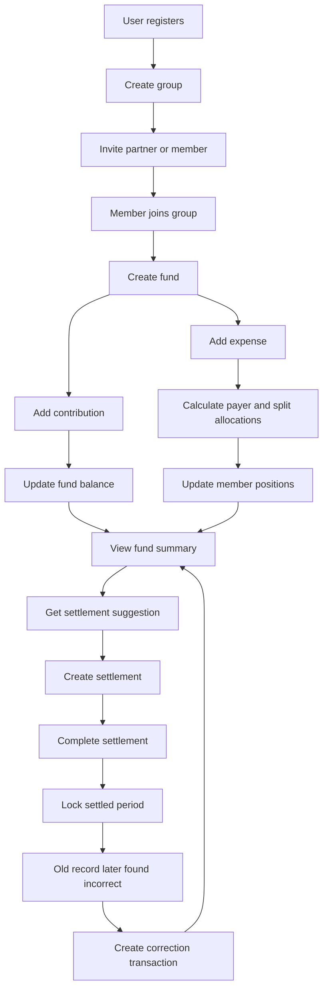
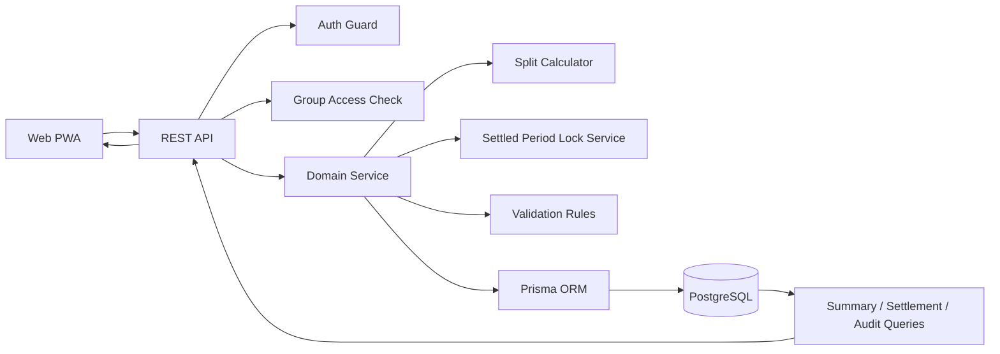
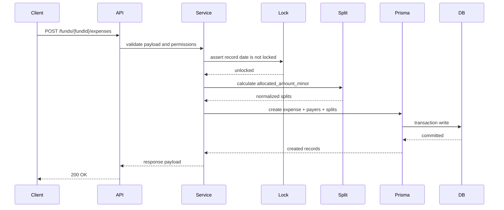
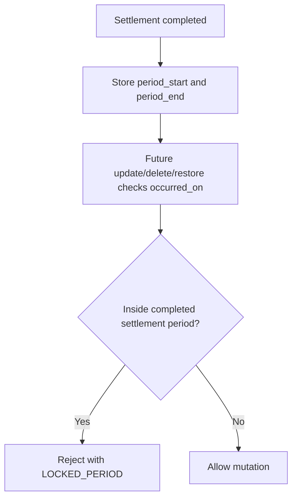
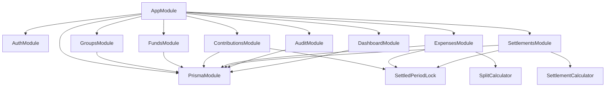
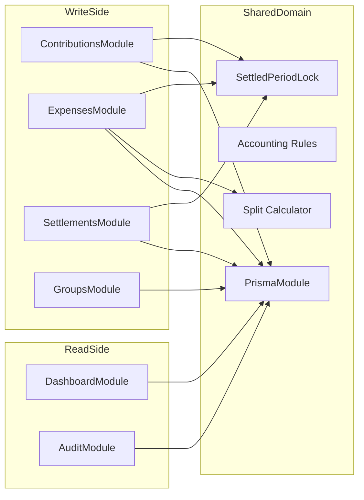
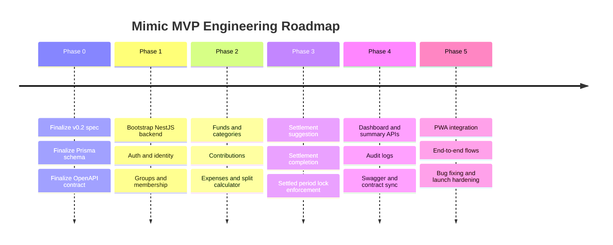

# Mimic PRD / Spec v0.2 Final

## Overview

### Product

Mimic is an installable, responsive Web PWA for couples and small groups.

### Core Value

* Shared virtual funds without opening a joint bank account
* Clear separation between contribution, expense, payer, settlement, and correction
* Responsive PWA workflow with offline-installable support
* Settled periods are locked and cannot be edited retroactively

### Target Users

Primary:

* Couples

Secondary:

* Roommates
* Families
* Small travel groups

## Product Rules

### Roles

* `owner`: can be multiple; manages group settings, members, funds, and settlements
* `member`: standard participant

### Accounting Rules

* Only group members can access group and fund data
* Expense split total must equal expense amount
* Payer and split participants are separate concepts
* Personal expense and fund expense must stay separate
* Financial records use soft delete
* Completed settlements lock their covered period
* Locked records cannot be updated, deleted, or restored by any role
* If an old settled record is wrong, users must add a new `correction` transaction

### Settlement Model

* Settlement is at fund level for MVP
* Settlement may be scheduled or manual
* Once a settlement is completed, transactions whose `occurred_on` falls within that settlement period become locked

## MVP Scope

### Included

* Auth
* Groups and invites
* Multiple owners
* Funds
* Categories
* Contributions
* Expenses
* Split modes: `equal`, `ratio`, `fixed`, `hybrid`
* Balance and member positions
* Settlement suggestions
* Settlement records
* Correction transactions
* Locking settled periods

### Excluded

* Bank integration
* OCR
* AI auto-booking
* Tax features

## Database Schema

### Design Principles

* Use minor units for all money values
* Separate current records from audit history
* Support multi-payer in schema, even if MVP UI starts with single payer
* Use service-layer validation for settlement lock and amount sum checks

### Prisma Enums

```prisma
enum UserStatus {
  ACTIVE
  DISABLED
}

enum GroupType {
  COUPLE
  GROUP
}

enum GroupStatus {
  ACTIVE
  ARCHIVED
}

enum MemberRole {
  OWNER
  MEMBER
}

enum MemberStatus {
  ACTIVE
  LEFT
  REMOVED
}

enum InviteStatus {
  PENDING
  ACCEPTED
  EXPIRED
  REVOKED
}

enum FundStatus {
  ACTIVE
  ARCHIVED
}

enum CategoryType {
  EXPENSE
}

enum CategoryStatus {
  ACTIVE
  ARCHIVED
}

enum RecordStatus {
  ACTIVE
  DELETED
}

enum ContributionType {
  REGULAR
  ONE_TIME
  ADJUSTMENT
  CORRECTION
}

enum ExpenseSplitMode {
  EQUAL
  RATIO
  FIXED
  HYBRID
}

enum ExpenseType {
  FUND_EXPENSE
  REFUND
  ADJUSTMENT
  CORRECTION
}

enum SplitType {
  EQUAL
  RATIO
  FIXED
}

enum SettlementStatus {
  PENDING
  COMPLETED
  CANCELED
}

enum SettlementType {
  SCHEDULED
  MANUAL
}

enum RecurringRuleStatus {
  ACTIVE
  PAUSED
  ENDED
}

enum AuditEntityType {
  GROUP
  FUND
  CATEGORY
  CONTRIBUTION
  EXPENSE
  SETTLEMENT
  RECURRING_RULE
  GROUP_MEMBER
}

enum AuditAction {
  CREATE
  UPDATE
  DELETE
  RESTORE
  COMPLETE
  CANCEL
  ARCHIVE
  UNARCHIVE
  ROLE_CHANGE
}
```

### Core Models

Core tables:

* `users`
* `groups`
* `group_members`
* `group_invites`
* `funds`
* `categories`
* `contributions`
* `expenses`
* `expense_payers`
* `expense_splits`
* `settlements`
* `recurring_contribution_rules`
* `audit_logs`

### Important Fields

* `Contribution.amount_minor`
* `Contribution.contribution_type`
* `Expense.amount_minor`
* `Expense.split_mode`
* `Expense.expense_type`
* `ExpensePayer.amount_minor`
* `ExpenseSplit.fixed_amount_minor`
* `ExpenseSplit.allocated_amount_minor`
* `Settlement.period_start`
* `Settlement.period_end`
* `Settlement.settlement_type`

### Required Service-Level Constraints

* `sum(expense_payers.amount_minor) = expenses.amount_minor`
* `sum(expense_splits.allocated_amount_minor) = expenses.amount_minor`
* `ratio_value` required for `ratio`
* `fixed_amount_minor` required for `fixed`
* `from_user_id != to_user_id`
* all related users must belong to the fund's group

### Lock Rule

```text
is_locked(fund_id, occurred_on) =
  exists completed settlement
  where settlement.fund_id = fund_id
    and occurred_on between settlement.period_start and settlement.period_end
```

### Balance Formula

```text
fund_balance =
  sum(active contributions.amount_minor)
  - sum(active expenses.amount_minor where expense_type = fund_expense)
  + sum(active expenses.amount_minor where expense_type = refund)
  ± adjustments
  ± corrections
```

## REST API

### Common Rules

* Base URL: `/api/v1`
* Auth: Bearer JWT
* Money fields use `amount_minor`
* Dates use `YYYY-MM-DD`
* Times use ISO 8601

### Response Format

Success:

```json
{
  "data": {},
  "meta": {}
}
```

Error:

```json
{
  "error": {
    "code": "VALIDATION_ERROR",
    "message": "human readable message",
    "details": {}
  }
}
```

### Main Endpoints

Auth:

* `POST /auth/register`
* `POST /auth/login`
* `POST /auth/refresh`
* `POST /auth/logout`
* `GET /me`
* `PATCH /me`

Groups:

* `POST /groups`
* `GET /groups`
* `GET /groups/{groupId}`
* `PATCH /groups/{groupId}`
* `GET /groups/{groupId}/members`
* `PATCH /groups/{groupId}/members/{memberId}`
* `POST /groups/{groupId}/invites`
* `POST /group-invites/accept`

Funds and categories:

* `POST /groups/{groupId}/funds`
* `GET /groups/{groupId}/funds`
* `GET /funds/{fundId}`
* `PATCH /funds/{fundId}`
* `POST /funds/{fundId}/archive`
* `POST /funds/{fundId}/unarchive`
* `GET /groups/{groupId}/categories`
* `POST /groups/{groupId}/categories`
* `PATCH /categories/{categoryId}`
* `POST /categories/{categoryId}/archive`

Transactions:

* `POST /funds/{fundId}/contributions`
* `GET /funds/{fundId}/contributions`
* `GET /contributions/{contributionId}`
* `PATCH /contributions/{contributionId}`
* `DELETE /contributions/{contributionId}`
* `POST /funds/{fundId}/expenses`
* `GET /funds/{fundId}/expenses`
* `GET /expenses/{expenseId}`
* `PATCH /expenses/{expenseId}`
* `DELETE /expenses/{expenseId}`
* `POST /expenses/{expenseId}/restore`

Settlements:

* `GET /funds/{fundId}/settlement-suggestion`
* `POST /funds/{fundId}/settlements`
* `GET /funds/{fundId}/settlements`
* `GET /settlements/{settlementId}`
* `POST /settlements/{settlementId}/complete`
* `POST /settlements/{settlementId}/cancel`

Other:

* `POST /funds/{fundId}/recurring-rules`
* `GET /funds/{fundId}/recurring-rules`
* `PATCH /recurring-rules/{ruleId}`
* `POST /recurring-rules/{ruleId}/pause`
* `POST /recurring-rules/{ruleId}/resume`
* `POST /recurring-rules/{ruleId}/end`
* `GET /audit-logs`
* `GET /audit-logs/{logId}`
* `GET /groups/{groupId}/dashboard`
* `GET /funds/{fundId}/summary`

### Example Requests

Create group:

```json
{
  "name": "我們的小基金",
  "group_type": "couple",
  "default_currency": "TWD"
}
```

Promote member to owner:

```json
{
  "role": "owner"
}
```

Create contribution:

```json
{
  "contributor_user_id": "user_uuid",
  "amount_minor": 5000,
  "contribution_type": "one_time",
  "occurred_on": "2026-04-06",
  "note": "四月投入"
}
```

Create correction contribution:

```json
{
  "contributor_user_id": "user_uuid",
  "amount_minor": -500,
  "contribution_type": "correction",
  "occurred_on": "2026-04-06",
  "note": "修正三月多記投入"
}
```

Create expense:

```json
{
  "title": "晚餐",
  "category_id": "category_uuid",
  "note": "聚餐",
  "amount_minor": 1000,
  "split_mode": "hybrid",
  "expense_type": "fund_expense",
  "occurred_on": "2026-04-06",
  "payers": [
    {
      "payer_user_id": "user_a",
      "amount_minor": 1000
    }
  ],
  "splits": [
    {
      "user_id": "user_a",
      "split_type": "fixed",
      "fixed_amount_minor": 300,
      "sort_order": 1
    },
    {
      "user_id": "user_b",
      "split_type": "ratio",
      "ratio_value": 0.5,
      "sort_order": 2
    },
    {
      "user_id": "user_c",
      "split_type": "ratio",
      "ratio_value": 0.5,
      "sort_order": 3
    }
  ]
}
```

Create correction expense:

```json
{
  "title": "修正三月晚餐少記 200",
  "amount_minor": 200,
  "split_mode": "equal",
  "expense_type": "correction",
  "occurred_on": "2026-04-06",
  "payers": [
    {
      "payer_user_id": "user_a",
      "amount_minor": 200
    }
  ],
  "splits": [
    {
      "user_id": "user_a",
      "split_type": "equal",
      "sort_order": 1
    },
    {
      "user_id": "user_b",
      "split_type": "equal",
      "sort_order": 2
    }
  ]
}
```

Create settlement:

```json
{
  "from_user_id": "user_b",
  "to_user_id": "user_a",
  "amount_minor": 2000,
  "period_start": "2026-04-01",
  "period_end": "2026-04-30",
  "settlement_type": "manual",
  "note": "四月結算"
}
```

Complete settlement:

```json
{
  "completed_at": "2026-04-06T10:30:00Z"
}
```

### Validation Rules

Expense:

* `payers` required
* `splits` required
* payers sum must equal `amount_minor`
* calculated splits sum must equal `amount_minor`
* all payer and split users must be group members

Contribution:

* contributor must be a member of the fund's group

Settlement:

* `from_user_id != to_user_id`
* `amount_minor > 0`
* `period_start <= period_end`

### Locking Rules

* If a transaction's `occurred_on` is inside any completed settlement period, it is locked
* Locked records cannot be updated, deleted, or restored
* Locked operations must return `LOCKED_PERIOD`

### Permissions

`member`:

* can view groups and funds they belong to
* can create transactions
* can update, delete, or restore their own unlocked transactions

`owner`:

* includes all member permissions
* can manage group settings
* can invite members
* can change member roles
* can manage any unlocked transaction
* can create and complete settlements
* still cannot modify locked transactions

### Suggested Error Codes

* `UNAUTHORIZED`
* `FORBIDDEN`
* `NOT_FOUND`
* `VALIDATION_ERROR`
* `SPLIT_TOTAL_MISMATCH`
* `PAYER_TOTAL_MISMATCH`
* `INVALID_SPLIT_MODE`
* `FUND_ARCHIVED`
* `MEMBER_NOT_IN_GROUP`
* `SETTLEMENT_ALREADY_COMPLETED`
* `RESOURCE_ALREADY_DELETED`
* `LOCKED_PERIOD`
* `LAST_OWNER_RESTRICTION`
* `CONFLICT`

## Functional Workflows

### Main User Journeys

The MVP should support five primary workflows:

* onboarding and group creation
* fund setup
* daily contribution and expense entry
* settlement completion and period locking
* correction flow for old settled records

### End-to-End Workflow



### Workflow Notes

* Contributions and expenses update the same shared fund balance, but they affect member positions differently.
* Settlement completion is the point where a historical period becomes immutable.
* Correction transactions do not reopen the old record; they create a new record that affects the current balance and future settlements.

## Data Flow

### Data Flow Overview

The system follows a request-driven flow:

1. The PWA sends a transaction request
2. API validates auth and membership
3. Domain service validates accounting rules
4. Prisma writes normalized records to PostgreSQL
5. Summary and settlement reads derive current positions from stored transaction data

### Runtime Data Flow



### Transaction Write Flow



### Settlement Lock Data Effect



## Backend Module Architecture

### Module Responsibility Summary

* `AuthModule`: identity, login, token handling
* `GroupsModule`: groups, invites, membership, role changes
* `FundsModule`: fund lifecycle and fund-level access
* `ContributionsModule`: contribution creation and mutation rules
* `ExpensesModule`: expense creation, split validation, payer handling
* `SettlementsModule`: settlement suggestion, completion, lock enforcement
* `AuditModule`: immutable activity history
* `DashboardModule`: summary and read models
* `PrismaModule`: database access

### Backend Module Diagram



### Write-Side and Read-Side Boundaries



## Engineering Roadmap

### Delivery Strategy

The engineering roadmap should move from contract definition to backend core, then to read models, and finally to client integration.

### Roadmap Timeline



### Recommended Delivery Milestones

| Milestone | Deliverable | Outcome |
| --- | --- | --- |
| M1 | Spec + schema + OpenAPI | Team aligns on contracts |
| M2 | Backend bootstrap + auth + groups | Team can create users and groups |
| M3 | Funds + contributions + expenses | Core bookkeeping works |
| M4 | Settlements + locking | Historical integrity works |
| M5 | Summary + audit | Product becomes reviewable end-to-end |
| M6 | Client integration | MVP becomes usable across surfaces |

### Exit Criteria Per Phase

* Phase 1: users can authenticate and create groups with correct owner membership
* Phase 2: users can create funds and add valid contributions / expenses
* Phase 3: users can complete settlements and locked records reject mutation
* Phase 4: fund summary, audit logs, and settlement suggestions are available
* Phase 5: the PWA can complete the main workflows against the shared backend
