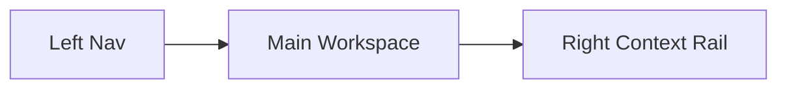
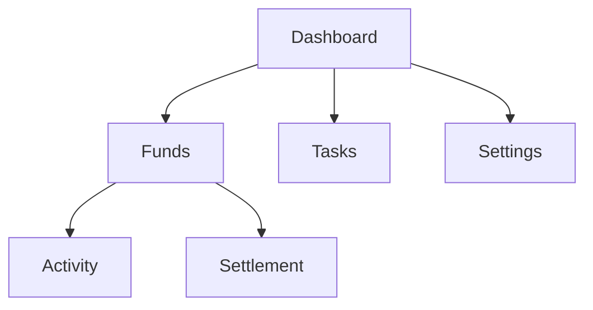

# Mimic Web UI Design v0.2

Date: 2026-04-07
Platform: Web
Direction: Warm desktop experience with richer information density

## Goal

Extend the Mimic product into a desktop-friendly Web experience that keeps the warm shared-life feeling from mobile while presenting more context, history, and management controls.

## Product Lens

The Web app should feel like:

* the same product as mobile
* calmer and roomier, not colder
* better for reviewing, comparing, and managing
* especially useful for activity history, settlement review, and settings

## Interaction Model

Recommended structure: `Split-focus`

* left column: global navigation
* center column: main workspace
* right column: always-available side context such as tasks, recent activity, and summaries

## Visual Direction

### Mood

* warm
* tidy
* grounded
* shared-life oriented

### Style Keywords

* paper-card dashboard
* soft shadows
* rounded panels
* warm beige surfaces
* coral action accents

### Layout Tokens

| Token | Suggested Value | Use |
|---|---|---|
| `page-max-width` | `1440px` | full page shell |
| `nav-width` | `248px` | left navigation |
| `side-rail-width` | `320px` | right context rail |
| `panel-radius` | `24px` | main panels |
| `panel-gap` | `20px` | desktop spacing |

## Information Architecture

### Top-Level Areas

### Recommended Left Navigation

* Dashboard
* Funds
* Activity
* Tasks
* Settings

### Recommended Right Rail Content

* pending tasks
* recent fund activity
* settlement reminders
* quick shortcuts

## Page Strategy

### 1. Dashboard

Purpose:

* show the health of the relationship finances at a glance
* surface active funds, balance, and next actions
* act as the default landing page

Priority order:

1. welcome and shared balance hero
2. active fund cards
3. recent activity summary
4. right-rail tasks and reminders

Wireframe: [web-dashboard-wireframe.svg](/d:/Project/mimic/docs/design/assets/web-wireframes/web-dashboard-wireframe.svg)
Mockup: [web-dashboard-mockup.svg](/d:/Project/mimic/docs/design/assets/web-mockups/web-dashboard-mockup.svg)

### 2. Fund Workspace

Purpose:

* let users stay inside one fund and inspect its story in more detail
* balance summary, member positions, and timeline in one screen
* give quick paths to new expense and settlement

Priority order:

1. fund header and actions
2. balance and member positions
3. timeline table or grouped list
4. right-rail fund-specific context

Wireframe: [web-fund-workspace-wireframe.svg](/d:/Project/mimic/docs/design/assets/web-wireframes/web-fund-workspace-wireframe.svg)
Mockup: [web-fund-workspace-mockup.svg](/d:/Project/mimic/docs/design/assets/web-mockups/web-fund-workspace-mockup.svg)

### 3. Activity / Records

Purpose:

* provide a fuller review surface than mobile
* make filters and grouped history easier to scan
* support correction entry from locked records

Priority order:

1. filter bar
2. activity table / grouped ledger list
3. record state badges
4. contextual actions

Wireframe: [web-activity-wireframe.svg](/d:/Project/mimic/docs/design/assets/web-wireframes/web-activity-wireframe.svg)
Mockup: [web-activity-mockup.svg](/d:/Project/mimic/docs/design/assets/web-mockups/web-activity-mockup.svg)

### 4. Settlement

Purpose:

* help users review settlement logic with more room and clarity
* make lock effect explicit before completion
* show current suggestion and prior settlement history

Priority order:

1. current settlement summary
2. transfer suggestions
3. lock explanation
4. prior settlements

Wireframe: [web-settlement-wireframe.svg](/d:/Project/mimic/docs/design/assets/web-wireframes/web-settlement-wireframe.svg)
Mockup: [web-settlement-mockup.svg](/d:/Project/mimic/docs/design/assets/web-mockups/web-settlement-mockup.svg)

### 5. Settings

Purpose:

* make account, group, and app management easier on desktop
* keep the tone light and domestic rather than administrative

Priority order:

1. account profile block
2. group and fund management cards
3. preferences and support

Wireframe: [web-settings-wireframe.svg](/d:/Project/mimic/docs/design/assets/web-wireframes/web-settings-wireframe.svg)
Mockup: [web-settings-mockup.svg](/d:/Project/mimic/docs/design/assets/web-mockups/web-settings-mockup.svg)

## Shared UX Rules

### Desktop Density Rule

Web can show more information than mobile, but should still prefer:

* grouped cards over flat admin tables
* readable spacing
* human-readable wording before raw bookkeeping detail

### Action Placement Rule

* primary screen action in the upper-right of the main panel
* secondary shortcuts in the right rail
* destructive actions visually separated from daily actions

### Locked Record Rule

When a record belongs to a settled period:

* edit action should be replaced by `Create Correction`
* show a clear locked badge
* include helper text explaining why the original record cannot be changed

## Deliverables In This Pass

### Wireframes

* [web-dashboard-wireframe.svg](/d:/Project/mimic/docs/design/assets/web-wireframes/web-dashboard-wireframe.svg)
* [web-fund-workspace-wireframe.svg](/d:/Project/mimic/docs/design/assets/web-wireframes/web-fund-workspace-wireframe.svg)
* [web-activity-wireframe.svg](/d:/Project/mimic/docs/design/assets/web-wireframes/web-activity-wireframe.svg)
* [web-settlement-wireframe.svg](/d:/Project/mimic/docs/design/assets/web-wireframes/web-settlement-wireframe.svg)
* [web-settings-wireframe.svg](/d:/Project/mimic/docs/design/assets/web-wireframes/web-settings-wireframe.svg)

### Mockups

* [web-dashboard-mockup.svg](/d:/Project/mimic/docs/design/assets/web-mockups/web-dashboard-mockup.svg)
* [web-fund-workspace-mockup.svg](/d:/Project/mimic/docs/design/assets/web-mockups/web-fund-workspace-mockup.svg)
* [web-activity-mockup.svg](/d:/Project/mimic/docs/design/assets/web-mockups/web-activity-mockup.svg)
* [web-settlement-mockup.svg](/d:/Project/mimic/docs/design/assets/web-mockups/web-settlement-mockup.svg)
* [web-settings-mockup.svg](/d:/Project/mimic/docs/design/assets/web-mockups/web-settings-mockup.svg)

## Next Web Steps

1. Add responsive behavior notes for tablet and narrow desktop
2. Define table patterns and empty states
3. Translate Web IA into Next.js route map and component inventory
