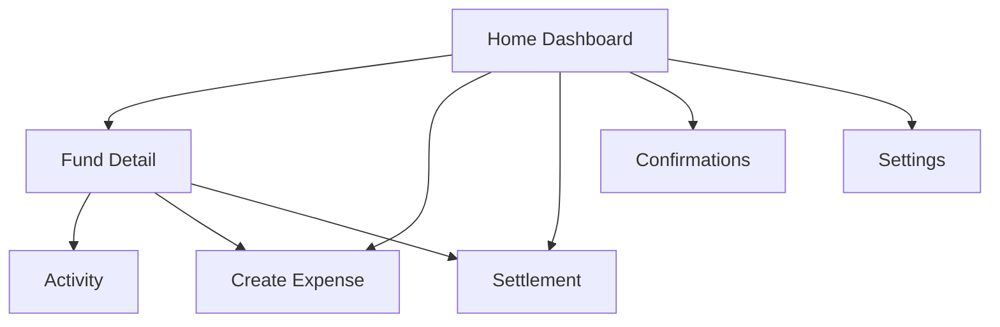

# PairFund Mobile Flutter Screen Spec v0.2

Date: 2026-04-07
Platform: Flutter
Design Basis: [pairfund-mobile-ui-v0.2.md](/d:/Project/mimic/docs/design/pairfund-mobile-ui-v0.2.md)

## Goal

Translate the first-round mobile mockups into implementation-ready Flutter screen specs and a reusable component inventory.

## App Structure

### Navigation Model

Use a two-level structure:

* level 1: global summary and global tasks
* level 2: fund-specific bookkeeping and settlement



### Suggested Router Names

| Screen | Route |
|---|---|
| Login | `/login` |
| Home Dashboard | `/home` |
| Fund Detail | `/funds/:fundId` |
| Create Expense | `/funds/:fundId/expenses/new` |
| Create Correction | `/funds/:fundId/corrections/new` |
| Settlement | `/funds/:fundId/settlement` |
| Activity | `/funds/:fundId/activity` or `/activity` |
| Confirmations | `/confirmations` |
| Settings | `/settings` |

## State Boundaries

### Global State

* current user
* selected group
* summary totals
* pending confirmations count
* router startup state starts at login and moves into home after auth

### Fund State

* fund detail
* fund balance
* member positions
* contribution and expense timeline
* settlement suggestion

### Form State

* create expense draft
* split mode and participant allocation draft
* correction type draft

## First-Round Screen Specs

### 1. Home Dashboard

Purpose:

* be the emotional and informational entry point
* surface total balance and active funds
* give direct access to add expense and settlement

#### Sections

1. top greeting bar
2. shared total balance hero card
3. active fund cards
4. quick action row
5. recent activity list
6. pending confirmations teaser

#### Required Data

* user display name
* total shared balance
* active fund summaries
* recent activity list
* pending confirmations count

#### Loading State

* skeleton hero card
* two skeleton fund cards
* three activity rows

#### Empty State

* no funds yet
* primary CTA: `Create Fund`
* no recent activity yet message

#### Primary Actions

* tap fund card -> fund detail
* tap `Add Expense` -> create expense
* tap `Settle` -> settlement
* tap pending teaser -> confirmations

#### Suggested Widget Tree

```text
HomeDashboardScreen
  SafeArea
    CustomScrollView
      SliverToBoxAdapter(AppHeader)
      SliverToBoxAdapter(BalanceHeroCard)
      SliverToBoxAdapter(FundCardCarousel)
      SliverToBoxAdapter(QuickActionRow)
      SliverToBoxAdapter(ActivityPreviewSection)
      SliverToBoxAdapter(PendingTaskBanner)
      SliverPadding(StickyPrimaryButton)
```

### 2. Fund Detail

Purpose:

* focus the user on one shared fund
* explain balance and member positions clearly
* connect timeline, actions, and settlement in one place

#### Sections

1. fund header
2. current balance hero
3. member positions card
4. this-month stats
5. timeline preview
6. sticky `Add Record` button

#### Required Data

* fund name and currency
* current balance
* member positions
* monthly expenses and contributions
* recent fund activity
* locked period summary if any

#### Loading State

* hero placeholder
* position rows placeholder
* stat card placeholder
* timeline placeholder

#### Empty State

* no records yet
* CTAs: `Add Expense`, `Add Contribution`
* no recent fund activity yet message

#### Primary Actions

* `Add Record`
* `View Activity`
* `View Settlement`
* transaction row -> record detail

### 3. Create Expense

Purpose:

* let users finish a complete expense entry quickly
* separate payer from split logic without confusion
* support correction as a special transaction type

#### Sections

1. transaction title
2. amount and category
3. payer block
4. split mode selector
5. participant allocation list
6. date and note
7. sticky submit button

#### Required Data

* fund members
* category list
* default date
* available split modes

#### Validation Rules

* title required
* amount must be positive
* payer total must equal amount
* split allocation total must equal amount
* at least one participant required
* correction type requires plain-language title

#### Error Presentation

* inline field error for title and amount
* inline helper and banner for split mismatch
* blocking dialog for settled-period lock if editing an existing record
* correction route is the fallback path once a settled-period record is locked

#### Primary Actions

* change split mode
* add or remove participant
* save expense

### 3b. Create Contribution

Purpose:

* let members record money added into a shared fund quickly
* keep contribution entry simpler than expense entry
* support the MVP bookkeeping loop without forcing full contribution history management yet

#### Sections

1. contribution intro card
2. amount input
3. contribution type selector
4. note field
5. occurred-on display
6. sticky save button

#### Required Data

* fund id
* current session user id
* default occurred-on date

#### Validation Rules

* amount must be positive
* contribution type must be selected

#### Current Scope

* create-only flow
* remote-backed post to `/funds/{fundId}/contributions`
* contributor uses current session user for MVP
* contribution list/detail/edit remain future work

### 4. Settlement

Purpose:

* explain settlement recommendation in human language
* clearly communicate period coverage and lock effect
* help users safely complete a settlement

#### Sections

1. covered period card
2. settlement suggestion card
3. lock explanation card
4. settlement history preview
5. sticky complete button

#### Required Data

* fund id
* settlement period
* settlement suggestion list
* prior settlement history

#### States

* no settlement needed
* one settlement suggestion
* multiple transfer suggestions
* already completed for current period

#### Primary Actions

* `Complete Settlement`
* view settlement history
* go back to fund detail

#### Remote Behavior

* settlement summary loads from remote when `ApiMode.remote`
* complete settlement posts to `/settlements/{settlementId}/complete`
* after completion the MVP shows snackbar feedback
* deeper post-completion refresh rules can remain incremental

### 5. Activity

Purpose:

* show one fund's bookkeeping timeline in a simple, readable sequence
* combine expenses, corrections, contributions, and settlements in one place
* give users lightweight status affordance without forcing them into record detail

#### Sections

1. activity intro copy
2. unified timeline list
3. correction and settlement status badges

#### Required Data

* expense list
* contribution list
* settlement list
* occurred-on dates
* settlement status labels

#### States

* loading spinner while timeline loads
* empty state with `No activity yet.`
* error state with retry-later copy

#### Current Scope

* remote-backed fund-specific timeline
* correction entries are inferred from expense records with `expense_type = correction`
* settlement rows can show `completed` or `pending`
* filters, pagination, and record detail remain future work

### 6. Settings

Purpose:

* let users review and edit their basic account profile
* keep logout in the same familiar location
* avoid expanding MVP settings into security or notification management too early

#### Sections

1. account profile card
2. display name input
3. locale input
4. timezone input
5. static preference preview
6. sign out action

#### Required Data

* email
* display name
* locale
* timezone

#### Remote Behavior

* profile loads from `GET /me`
* profile updates currently use `POST /me` until the shared mobile API client grows `patch()`
* sign out remains owned by `AuthController`
* notification preferences remain static/future work

## Component Inventory

### Foundation Components

| Component | Purpose | Notes |
|---|---|---|
| `PfScaffold` | shared page scaffold | handles warm background and safe spacing |
| `PfSectionTitle` | section header | used across screens |
| `PfPrimaryButton` | main CTA | supports full-width sticky style |
| `PfSecondaryChip` | compact action or filter chip | for split mode and tags |
| `PfListRow` | reusable list row | activity, settings, confirmations |

### Summary Components

| Component | Purpose | Used In |
|---|---|---|
| `PfBalanceHeroCard` | large balance display | home, fund detail |
| `PfFundCard` | fund summary preview | home |
| `PfStatCard` | compact metric block | fund detail |
| `PfMemberPositionRow` | user position display | fund detail, settlement |

### Transaction Components

| Component | Purpose | Used In |
|---|---|---|
| `PfTransactionRow` | activity item display | home, fund detail, activity |
| `PfPayerSelectorCard` | payer selector and amount | create expense |
| `PfSplitModeChips` | equal/ratio/fixed/hybrid switcher | create expense |
| `PfParticipantAllocationRow` | participant and amount row | create expense, correction |
| `PfLockedInfoBanner` | settled-period explanation | fund detail, correction, activity |

### Settlement Components

| Component | Purpose | Used In |
|---|---|---|
| `PfSettlementSuggestionCard` | human-readable transfer summary | settlement |
| `PfSettlementPeriodCard` | covered period summary | settlement |
| `PfLockWarningCard` | explains lock consequences | settlement |

## Design Tokens To Mirror In Flutter

### Colors

* `appBg = Color(0xFFF7F1EA)`
* `surfaceBg = Color(0xFFFFF8F2)`
* `inkPrimary = Color(0xFF2F241F)`
* `inkSecondary = Color(0xFF6F5B52)`
* `accentMain = Color(0xFFD7795F)`
* `accentSoft = Color(0xFFF2D7C9)`
* `successSoft = Color(0xFFDCEAD9)`
* `warningSoft = Color(0xFFF6E4C8)`

### Shape

* hero radius: `24`
* card radius: `22`
* chip radius: `14`
* sticky CTA radius: `22`

### Spacing

* screen horizontal padding: `16`
* section gap: `20`
* card internal padding: `18`

## Suggested File Layout

```text
lib/
  features/
    home/
      presentation/
        home_dashboard_screen.dart
        widgets/
    funds/
      presentation/
        fund_detail_screen.dart
        widgets/
    expenses/
      presentation/
        create_expense_screen.dart
        widgets/
    settlements/
      presentation/
        settlement_screen.dart
        widgets/
  shared/
    presentation/
      widgets/
        pf_scaffold.dart
        pf_balance_hero_card.dart
        pf_primary_button.dart
```

## Handoff Notes

1. Build foundation components first, then assemble screens.
2. Keep summary components style-consistent with the mockups before optimizing for density.
3. Treat settled-period lock messaging as a reusable pattern, not a one-off message.

## Remote Readiness Snapshot

This section summarizes the current mobile data-layer readiness for `ApiMode.remote`.

### Ready For First Real Integration

* auth login
* session restore on startup
* home summary
* fund detail
* create fund
* create expense
* create correction
* settlement summary and completion
* tasks list and confirmation actions
* fund activity timeline

### Partial

* settings
  * logout is wired
  * profile read/write is still static UI

### Demo-only

* contribution create flow
* expense edit / delete / restore
* recurring rule management
* category management

### Current Remote Assumptions

* home summary is derived from `/me`, `/groups`, and `/groups/{groupId}/funds`
* create fund currently uses the first returned group as the working group
* correction uses the expense create endpoint with `expense_type = correction`
* tasks currently map directly from `/confirmations`
* activity currently aggregates `/funds/{fundId}/expenses`, `/funds/{fundId}/contributions`, and `/funds/{fundId}/settlements`
* pending confirmation cards support approve / reject with optional comment input
* 401 responses trigger `/auth/refresh`, then retry the original request after a successful refresh

Reference:
[pairfund-mobile-remote-readiness-checklist-v0.2.md](/d:/Project/mimic/docs/design/pairfund-mobile-remote-readiness-checklist-v0.2.md)

### Updated MVP Notes

* tasks screen now uses an optional comment dialog for approve / reject confirmation actions
* contribution create is now available as a remote-backed create-only flow
* auth transport now supports refresh-token retry and clears session when refresh fails
* settings profile read/write is remote-backed for display name, locale, and timezone
