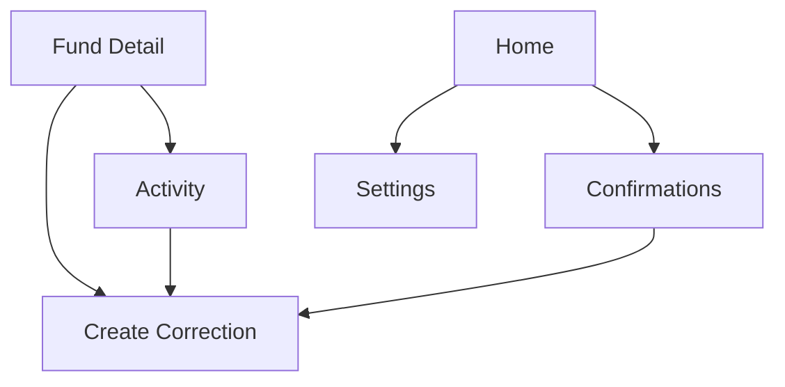

# PairFund Mobile UI Round 2 v0.2

Date: 2026-04-07
Platform: Mobile app
Structure: Option C, summary-first home plus fund-centered bookkeeping

## Goal

Extend the first-round mobile design with the next four operational screens:

* Activity
* Confirmations
* Settings
* Correction flow

## Product Role Of Each Screen

### Activity

The searchable memory of what happened in a fund or across funds.

### Confirmations

A warm, approachable task center for pending items that need user attention.

### Settings

The quiet management space for account, group, fund, and app preferences.

### Correction Flow

The safe path for fixing old settled mistakes without rewriting history.

## Round 2 Information Architecture

## Screen Strategy

### 1. Activity

Purpose:

* show historical records in a way that feels readable, not audit-heavy
* allow users to filter by type, member, and period
* provide an entry point to correction when a settled record looks wrong

Priority order:

1. title and active fund or global scope
2. filter chips
3. grouped activity list
4. record detail affordance
5. correction CTA on locked records

Wireframe: [activity-wireframe.svg](/d:/Project/mimic/docs/design/assets/mobile-wireframes/activity-wireframe.svg)
Mockup: [activity-mockup.svg](/d:/Project/mimic/docs/design/assets/mobile-mockups/activity-mockup.svg)

### 2. Confirmations

Purpose:

* act like a task center, not a cold approval queue
* help users quickly understand what needs action
* connect pending items to the right follow-up screen

Priority order:

1. pending count and gentle summary
2. task cards by urgency
3. completed tasks toggle
4. CTA into the related screen

Wireframe: [confirmations-wireframe.svg](/d:/Project/mimic/docs/design/assets/mobile-wireframes/confirmations-wireframe.svg)
Mockup: [confirmations-mockup.svg](/d:/Project/mimic/docs/design/assets/mobile-mockups/confirmations-mockup.svg)

### 3. Settings

Purpose:

* keep management tasks tidy and low-stress
* separate personal settings from group and fund settings
* avoid admin-heavy visual tone

Priority order:

1. account card
2. group and fund management shortcuts
3. app preferences
4. support and sign-out

Wireframe: [settings-wireframe.svg](/d:/Project/mimic/docs/design/assets/mobile-wireframes/settings-wireframe.svg)
Mockup: [settings-mockup.svg](/d:/Project/mimic/docs/design/assets/mobile-mockups/settings-mockup.svg)

### 4. Correction Flow

Purpose:

* let users fix mistakes safely after settlement
* make it obvious that the original record stays unchanged
* keep the flow emotionally calm and non-punitive

Priority order:

1. why this flow exists
2. original settled record summary
3. correction transaction form
4. explanation note
5. submit CTA

Wireframe: [correction-wireframe.svg](/d:/Project/mimic/docs/design/assets/mobile-wireframes/correction-wireframe.svg)
Mockup: [correction-mockup.svg](/d:/Project/mimic/docs/design/assets/mobile-mockups/correction-mockup.svg)

## Shared Interaction Principles

### Activity To Correction

If a locked record is opened from Activity:

* hide edit affordance
* show `Settled period record`
* offer `Create Correction`

### Confirmations As Task Center

Confirmation cards should read like actionable reminders:

* `Recurring top-up reminder`
* `Settlement waiting for completion`
* `Correction needs review`

They should not read like rigid admin workflow labels.

### Settings Tone

Settings should feel supportive and domestic, not enterprise:

* simple labels
* warm spacing
* grouped cards instead of dense lists

### Correction Language

Use human wording:

* `What should be corrected?`
* `Original record stays unchanged`
* `Add a new correction record`

Avoid language that sounds punitive or system-centric.

## Deliverables In This Pass

### Wireframes

* [activity-wireframe.svg](/d:/Project/mimic/docs/design/assets/mobile-wireframes/activity-wireframe.svg)
* [confirmations-wireframe.svg](/d:/Project/mimic/docs/design/assets/mobile-wireframes/confirmations-wireframe.svg)
* [settings-wireframe.svg](/d:/Project/mimic/docs/design/assets/mobile-wireframes/settings-wireframe.svg)
* [correction-wireframe.svg](/d:/Project/mimic/docs/design/assets/mobile-wireframes/correction-wireframe.svg)

### Mockups

* [activity-mockup.svg](/d:/Project/mimic/docs/design/assets/mobile-mockups/activity-mockup.svg)
* [confirmations-mockup.svg](/d:/Project/mimic/docs/design/assets/mobile-mockups/confirmations-mockup.svg)
* [settings-mockup.svg](/d:/Project/mimic/docs/design/assets/mobile-mockups/settings-mockup.svg)
* [correction-mockup.svg](/d:/Project/mimic/docs/design/assets/mobile-mockups/correction-mockup.svg)

## Next UI Steps

1. Add record detail sheet and locked-state detail screen
2. Define empty and error states for all eight screens
3. Build Flutter component map for round 2 screens
