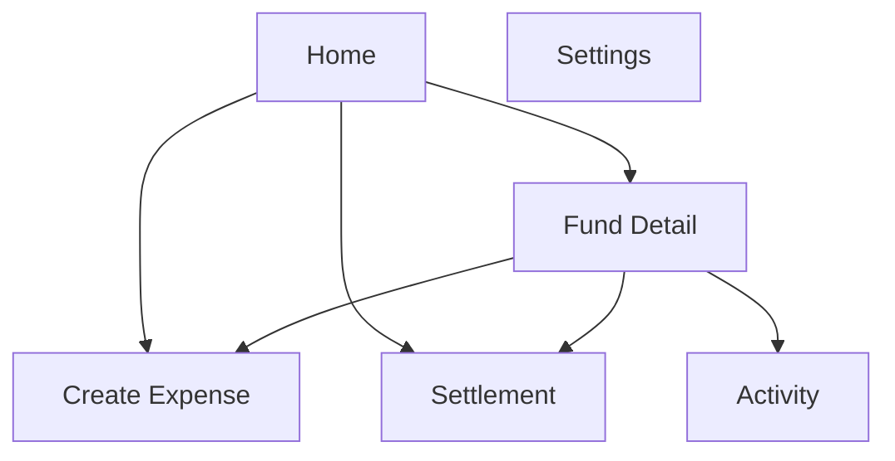

# PairFund Mobile UI Design v0.2

Date: 2026-04-06
Platform: Mobile app
Priority: MVP core flow

## Design Goal

Create a warm, daily-use mobile experience that feels like a shared life tool rather than a cold accounting dashboard.

## Product Lens

The UI should make these ideas obvious:

* users are managing shared funds, not only splitting bills
* balance comes first
* actions should feel low-friction
* settled history is trustworthy and locked
* corrections should feel explicit and safe

## Visual Direction

### Mood

* warm
* intimate
* calm
* trustworthy

### Style Keywords

* soft cards
* rounded containers
* paper-like surfaces
* muted warm neutrals
* coral and terracotta accents

### Suggested Color Tokens

| Token | Value | Use |
|---|---|---|
| `bg-app` | `#F7F1EA` | app background |
| `bg-surface` | `#FFF8F2` | cards and sheets |
| `ink-primary` | `#2F241F` | headings |
| `ink-secondary` | `#6F5B52` | secondary text |
| `accent-main` | `#D7795F` | primary action |
| `accent-soft` | `#F2D7C9` | badge and chart fill |
| `success-soft` | `#DCEAD9` | positive state |
| `warning-soft` | `#F6E4C8` | pending state |

### Typography Direction

* rounded grotesk or humanist sans
* strong numeric emphasis for balances
* generous line-height and card spacing

## Information Architecture

### Primary Navigation

### MVP Core Screens

1. Home Dashboard
2. Fund Detail
3. Create Expense
4. Settlement

## Screen Strategy

### 1. Home Dashboard

Purpose:

* show total balance first
* show active funds as the main entry point
* keep recent activity and action shortcuts close by

Priority order:

1. greeting and total shared balance
2. fund cards
3. quick actions
4. recent activity
5. pending items

Wireframe: [dashboard-wireframe.svg](/d:/Project/mimic/docs/design/assets/mobile-wireframes/dashboard-wireframe.svg)
Mockup: [dashboard-mockup.svg](/d:/Project/mimic/docs/design/assets/mobile-mockups/dashboard-mockup.svg)

### 2. Fund Detail

Purpose:

* show one fund as a living shared bucket
* make the balance and member positions easy to understand
* support quick jump to add expense or view settlement

Priority order:

1. fund header and balance
2. position summary by member
3. month stats
4. timeline of transactions
5. locked-period explanation if relevant

Wireframe: [fund-detail-wireframe.svg](/d:/Project/mimic/docs/design/assets/mobile-wireframes/fund-detail-wireframe.svg)
Mockup: [fund-detail-mockup.svg](/d:/Project/mimic/docs/design/assets/mobile-mockups/fund-detail-mockup.svg)

### 3. Create Expense

Purpose:

* make daily bookkeeping fast
* keep split logic understandable
* surface payer and split as separate ideas

Priority order:

1. title and amount
2. category and date
3. payer block
4. split mode block
5. participants and allocations
6. save action

Wireframe: [expense-create-wireframe.svg](/d:/Project/mimic/docs/design/assets/mobile-wireframes/expense-create-wireframe.svg)
Mockup: [expense-create-mockup.svg](/d:/Project/mimic/docs/design/assets/mobile-mockups/expense-create-mockup.svg)

### 4. Settlement

Purpose:

* explain settlement in human language
* reduce anxiety around who pays whom
* clearly show that completion locks the covered period

Priority order:

1. settlement summary
2. human-readable suggestion cards
3. covered period
4. warning about lock behavior
5. complete settlement action

Wireframe: [settlement-wireframe.svg](/d:/Project/mimic/docs/design/assets/mobile-wireframes/settlement-wireframe.svg)
Mockup: [settlement-mockup.svg](/d:/Project/mimic/docs/design/assets/mobile-mockups/settlement-mockup.svg)

## Interaction Notes

### Quick Action Pattern

Use a floating primary action or sticky bottom action on key screens:

* Home: `Add Expense`
* Fund Detail: `Add Record`
* Create Expense: `Save Expense`
* Settlement: `Complete Settlement`

### Locked Period UX

When a record belongs to a settled period:

* editing controls should be hidden or disabled
* show a plain-language explanation
* offer `Create Correction` instead of `Edit`

### Correction UX

Correction is a first-class transaction type in the form flow:

* user chooses `Correction`
* title is required and must explain intent in plain words
* UI explains that the original settled record will remain unchanged

## Deliverables In This Pass

### Wireframes

* [dashboard-wireframe.svg](/d:/Project/mimic/docs/design/assets/mobile-wireframes/dashboard-wireframe.svg)
* [fund-detail-wireframe.svg](/d:/Project/mimic/docs/design/assets/mobile-wireframes/fund-detail-wireframe.svg)
* [expense-create-wireframe.svg](/d:/Project/mimic/docs/design/assets/mobile-wireframes/expense-create-wireframe.svg)
* [settlement-wireframe.svg](/d:/Project/mimic/docs/design/assets/mobile-wireframes/settlement-wireframe.svg)

### Mockups

* [dashboard-mockup.svg](/d:/Project/mimic/docs/design/assets/mobile-mockups/dashboard-mockup.svg)
* [fund-detail-mockup.svg](/d:/Project/mimic/docs/design/assets/mobile-mockups/fund-detail-mockup.svg)
* [expense-create-mockup.svg](/d:/Project/mimic/docs/design/assets/mobile-mockups/expense-create-mockup.svg)
* [settlement-mockup.svg](/d:/Project/mimic/docs/design/assets/mobile-mockups/settlement-mockup.svg)

## Next UI Steps

1. Extend the same design system to Activity, Confirmations, and Settings
2. Convert these mockups into a Flutter screen map and component inventory
3. Add empty, error, and locked-state screens
